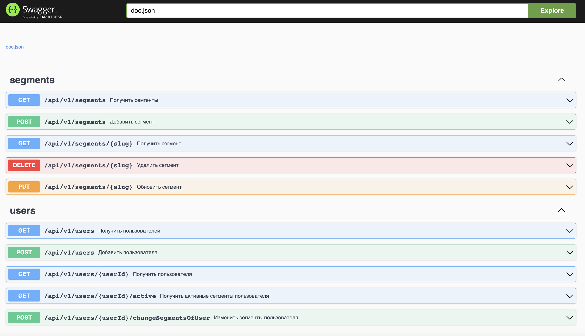
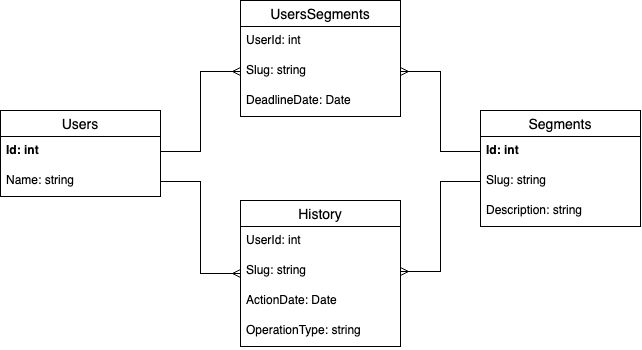

# 🧑‍🔬 Тестовое задание Avito

Сервис для управления сегментами и их доступностью у пользователей Avito.

## Содержание

1. [Описание задания](#описание-задания)
2. [Запуск сервиса](#запуск-сервиса)
3. [Спецификация API](#спецификация-api)
4. [Детали реализации](#детали-реализации)
5. [Вопросы, возникшие в ходе выполнения задания](#вопросы-возникшие-в-ходе-выполнения-задания)
6. [Прогресс выполнения поставленных задач](#прогресс-выполнения-поставленных-задач)

## Описание задания

### Проблема:

В Авито часто проводятся различные эксперименты — тесты новых продуктов, тесты интерфейса, скидочные и многие другие. На архитектурном комитете приняли решение централизовать работу с проводимыми экспериментами и вынести этот функционал в отдельный сервис.

### Задача:

Требуется реализовать сервис, хранящий пользователя и сегменты, в которых он состоит (создание, изменение, удаление сегментов, а также добавление и удаление пользователей в сегмент).

## Запуск сервиса

Для начала необходимо склонировать репозиторий:

```
git clone https://github.com/TinyMarcus/avito-tech-task.git
```

Далее нужно перейти в директорию:

```
cd avito-tech-task
```

Для быстрого запуска сервиса можно воспользоваться утилитой make, которая произведет сборку и запуск приложения. Приложение будет доступно на порту 8080:

```
make build
make run
```

Запускается разработанный сервис в docker-контейнере с использованием `docker-compose`. Во время запуска также поднимается база данных `PostgreSQL` в отдельном контейнере, в которой создается база данных `dynamic-user-segmentation` с таблицами `segments`, `users`, `history`, `users_segments`. 

Механизм миграции на данном этапе не реализован, создание базы данных и таблиц происходит запуском SQL-скрипта при инициализации контейнера.

## Спецификация API
1. Разработанное API реализовано в соответствии с дизайном RESTful API.
2. Тело запроса и ответа передается в формате JSON.
3. При возникновении ошибки во время выполнения запроса в качестве результата будут возвращены HTTP-статус код в заголовке и описание ошибки в теле в формате `{"error": "message}`.
4. Реализована поддержка Swagger и Swagger UI для удобной работы с API во время разработки — для доступа к нему необходимо перейти по URL: `http://localhost:8080/swagger/index.html`.

Ниже приведена полная спецификация разработанного API с примерами запросов.

## Работа с сегментами
### POST /api/v1/segments

Добавление сегмента в БД.

* Тело запроса:
    * `slug` — название сегмента;
    * `description` — описание сегмента.
* Тело ответа (код 201):
    * `slug` — название сегмента.

**Пример запроса**:

Запрос:

```
curl -X POST localhost:8080/api/v1/segments \
-H "Content-Type: application/json" \
-d '{
	"slug": "AVITO_VOICE_MESSAGES",
	"description": "Голосовые сообщения в чатах"
}'
```

Ответ:

```
{
    "slug": "AVITO_VOICE_MESSAGES"
}
```

### GET /api/v1/segments/{slug}

Получение сегмента по названию.

* Параметры строки запроса:
    * `slug` — название сегмента.
* Тело ответа (код 200):
    * искомый сегмент.

**Пример запроса**:

Запрос:

```
curl -X GET localhost:8080/api/v1/segments/AVITO_VOICE_MESSAGES
```

Ответ:

```
{
    "id": 1,
    "slug": "AVITO_VOICE_MESSAGES",
    "description": "Голосовые сообщения в чатах"
}
```

### GET /api/v1/segments

Получение всех сегментов.

* Тело ответа (код 200):
    * список всех сегментов.

**Пример запроса**:

Запрос:

```
curl -X GET localhost:8080/api/v1/segments
```

Ответ:

```
[
    {
        "id": 1,
        "slug": "AVITO_VOICE_MESSAGES",
        "description": "Голосовые сообщения в чатах"
    },
    {
        "id": 2,
        "slug": "AVITO_PERFORMANCE_VAS",
        "description": "Новые услуги продвижения"
    },
    {
        "id": 3,
        "slug": "AVITO_DISCOUNT_30",
        "description": "Скидка 30% на услуги продвижения"
    },
    {
        "id": 4,
        "slug": "AVITO_DISCOUNT_50",
        "description": "Скидка 50% на услуги продвижения"
    },
]
```

### PUT /api/v1/segments/{slug}

Изменение сегмента в БД.

* Параметры строки запроса:
    * `slug` — исходное название сегмента.
* Тело запроса:
    * `slug` — новое название сегмента;
    * `description` — новое описание сегмента.
* Тело ответа (код 200):
    * `id` — идентификатор сегмента;
    * `slug` — новое название сегмента;
    * `description` — новое описание сегмента.

**Пример запроса**:

Запрос:

```
curl -X PUT localhost:8080/api/v1/segments/AVITO_VOICE_MESSAGES \
-H "Content-Type: application/json" \
-d '{
	"slug": "AVITO_VOICE_MESSAGES",
	"description": "Новое демонстрационное описание"
}'
```

Ответ:

```
{
    "id": 1,
    "slug": "AVITO_VOICE_MESSAGES",
    "description": "Новое демонстрационное описание",
}
```

### DELETE /api/v1/segments/{slug}

Удаление сегмента из БД.

* Параметры строки запроса:
    * `slug` — название сегмента.
* Параметры ответа:
    * HTTP-статус код 204.

**Пример запроса**:

Запрос:

```
curl -X DELETE localhost:8080/api/v1/segments/AVITO_VOICE_MESSAGES
```


## Работа с пользователями
### POST /api/v1/users

Добавление пользователя в БД.

* Тело запроса:
    * `name` — имя пользователя.
* Тело ответа (код 201):
    * `id` — идентификатор пользователя.

**Пример запроса**:

Запрос:

```
curl -X POST localhost:8080/api/v1/users \
-H "Content-Type: application/json" \
-d '{
	"name": "Ivan Ivanov"
}'
```

Ответ:

```
{
    "id": 1
}
```

### GET /api/v1/users/{userId}

Получение пользовател по идентификатору.

* Параметры строки запроса:
    * `userId` — идентификатор пользователя.
* Тело ответа (код 200):
    * искомый пользователь.

**Пример запроса**:

Запрос:

```
curl -X GET localhost:8080/api/v1/users/1
```

Ответ:

```
{
    "id": 1,
    "name": "Ivan Ivanov"
}
```

### GET /api/v1/users

Получение всех пользователей.

* Тело ответа (код 200):
    * список всех пользователей.

**Пример запроса**:

Запрос:

```
curl -X GET localhost:8080/api/v1/users
```

Ответ:

```
[
    {
        "id": 1,
        "name": "Ivan Ivanov"
    },
    {
        "id": 2,
        "name": "Petr Petrov"
    }
]
```

### POST /api/v1/users/{userId}/changeSegmentsOfUser

Добавление пользователей в сегмент и удаление из них.

* Параметры строки запроса:
    * `userId` — идентификатор пользователя.
* Тело запроса:
    * `add_to_user` — сегменты, в которые будет добавляться пользователь;
    * `take_from_user` — сегменты, из которых будет убираться пользователь.
* Параметры ответа:
    * HTTP-статус код 200.

**Пример запроса**:

Запрос:

```
curl -X POST localhost:8080/api/v1/users/1/changeSegmentsOfUser \
-H "Content-Type: application/json" \
-d '{
	"add_to_user": [
        {
            "slug": "AVITO_VOICE_MESSAGES",
            "deadline_date": "2023-09-30 12:00:00+03"
        },
        {
            "slug": "AVITO_DISCOUNT_50"
        }
    ],
    "take_from_user": [
        "AVITO_DISCOUNT_30"
    ]
}'
```


### GET /api/v1/users/{userId}/active

Получение активных сегментов пользователя.

* Параметры строки запроса:
    * `userId` — идентификатор пользователя.
* Параметры ответа:
    * HTTP-статус код 200.

**Пример запроса**:

Запрос:

```
curl -X GET localhost:8080/api/v1/users/1/active
```

Ответ:

```
{
    "userId": 1,
    "segments": [
        {
            "slug": "AVITO_VOICE_MESSAGES",
            "deadline_date": "2023-09-31 12:00:00+03"
        },
        {
            "slug": "AVITO_DISCOUNT_50"
        }
    ]
}
```

Также важно отметить, что все приведенные выше запросы для взаимодействия с пользователями и сегментами можно тестировать с использованием Swagger UI:



## Детали реализации

Ниже приведена структура проекта разработанного сервиса:

```
.
├── internal
│   ├── config                              // конфигурация приложения
│   ├── db                                  // подключение к БД
│   ├── handlers                            // обработчики входящих запросов
│   │   ├── dtos                            // DTO-модели
│   │   └── middlewares                     // миддлвейры (в частности для логирования запросов) 
│   ├── logger                              // логгер и его конфигурация
│   ├── models                              // основные структуры для работы с сущностями БД
│   ├── repositories                        // репозитории с методами для взаимодействия с БД
├── cmd/dynamic-user-segmentation-service   // точка входа в приложение
└── api                                     // документация Swagger
```

При разработке сервиса автор придерживался:
* следование GitFlow (была создана ветка `develop`, от которой создавались остальные ветки по мере продвижения реализации сервиса);
* следованию дизайну RESTful API;
* подхода разделения севриса на разные слои (чистая архитектура), а также внедрения зависимостей;
* работы с СУБД PostgreSQL с использованием библиотеки `sqlx` и написанием сырых SQL-запросов;
* использование docker и docker-compose для поднятия и развертывания dev-среды (с накатыванием схемы БД при запуске).

Также было начато, но недоделано:
* юнит-тестирование с помощью моков (использовались библиотеки `testify` и `gomock`) — были созданы мок для репозитория, но из-за нехватки времени тесты не были написаны;
* поддержка запроса истории — был реализован репозиторий с методами записи добавления и удаления пользователей из сегментов, но не написан метод и "ручка" для получения истории. 

### Схема БД

Ниже приведена разработанная схема базы данных для сервиса.



В базе данных всего **4 таблицы**: таблица с пользователями, таблица с сегментами, таблица, связывающая пользователей и сегментов (связь многие-ко-многим), а также таблица с историей добавления/удаления сегментов у пользователя (связь многие-ко-многим).

Таблица с историей была создана для выполнения дополнительного задания №1 с запросом истории пользователей, но задание не было завершено — была реализована запись истории, но не ее получение.

### Архитектура сервиса

Для поддержания чистой архитектуры и упрощения разработки сервиса в будущем архитектура сервиса была разделена на несколько слоев — на слой работы с БД и на слой обработки входящих запросов.

Для взаимодействия с БД был реализован паттерн "Репозиторий" и написаны репозитории для работы с таблицами пользователей, сегментов и истории (`userRepository`, `segmentRepository` и `historyRepository` соответственно). Репозитории были реализованы для СУБД PostgreSQL — при необходимости работы с другими СУБД использованный подход позволяет с легкостью заменить реализацию репозиториев на новую необходимую.

Для обработки входящих запросов были реализованы хендлеры (или контроллеры), которые, принимая входные данные, вызывали в своих методах методы репозиториев, передавая туда всю необходимую информацию для записи в БД.

## Вопросы, возникшие в ходе выполнения задания

1. Возник вопрос с хранением пользователей в БД данного сервиса в отдельной таблице — при эксплуатации в реальности сервису нет необходимости хранить информацию о пользователях отдельно, так как сервис должен работать только с привязкой пользователей к сегментам. Но для полноты представления "пайплайна" и хранения всей необходимой информации в рамках тестового задания (возможности запрашивать пользователей у меня не было, так как для этого нужно либо создавать отдельный сервис, либо получать информацию о пользователе из запроса (но тогда не было бы возможности делать проверку на существование пользователя, которую хотелось добавить)) я принял решение хранить информацию о пользователях отдельно в таблице `Users`. Именно по этой логике есть "ручка" для создания пользователя, но не его удаления или изменения.
2. Изначально у меня возникло желание для отображения идентификатора пользователя и сегмента использовать тип данных `uuid` вместо `int`, так как на большом проде из-за существования в системе большого числа пользователей, а также для соблюдения безопасности, используется этот тип данных, но из-за того, что в условии идентификаторы пользователей были целочисленные, я решил использовать все же его :)
3. У меня было желание реализовать поддержку миграций, но я остановился на использовании SQL-скрипта для создания базы данных и необходимых таблиц. Но при этом, как я писал выше, схема создается автоматически при запуске через docker (в случае если она не существует).
4. При выполнении дополнительного задания №2 возник вопрос, какие принадлежности сегмента пользователю считать "активными". Активными являются привязки, которые либо не содержат дату "протухания", так как они активны всегда, пока их не удалят (`deadline_date = null`), либо содержать дату, которая еще не наступила. При этом отмечу, что по истечении даты "протухания" запись из таблицы `UsersSegments` автоматически не удаляется — она просто перестает получаться при запросе активных привязок пользователя к сегментам. Запись из таблицы будет удалена при отправке POST-запроса с изменением сегментов, в которых принимает участие пользователь.

## Прогресс выполнения поставленных задач

| Задача  | Прогресс | Комментарий |
|---------|:----------:|-------------|
| **Метод создания сегмента** | ✅ | |
| **Метод удаления сегмента** | ✅ | |
| **Метод добавления пользователя в сегмент** | ✅ | Добавлена проверка при попытке повторного добавления или удаления сегментов у пользователя — они будут пропускаться |
| **Метод получения активных сегментов пользователя** | ✅ | Так как **было выполнено дополнительное задание №2**, активными сегментами считаются те, у которых не стоит `deadline_date` или `deadline_date` еще не наступил |
| **Покрытие кода тестами** | 🙈 | Были созданы моки, а также добавлено создание БД для тестов, но из-за нехватки времени реализация тестов не была доделана |
| **Swagger** | ✅ | |
| **Доп. задание №1 (*история*)** | 🙈 | Было реализовано сохранение истории в БД, но осталось нереализованным получение истории в формате отчета |
| **Доп. задание №2 (*дедлайн*)** | ✅ | Была реализована поддержка установки дедлайна — по истечении срока при запросе активных сегментов пользователя сегмент с просроченным дедлайном возвращаться не будет (но при этом не реализована автоматическая очистка таблицы с сегментами от просроченной поддержки сегмента: необходимо удалять вручную с использованием POST-запроса с изменением сегментов пользователя) |
| **Доп. задание №3 (*seed*)** | ❌ | |
| **Запуск в docker** | ✅ | |
| **CI/CD** | 🙈 | Добавлены этап Build и Test в GitHub Actions |
